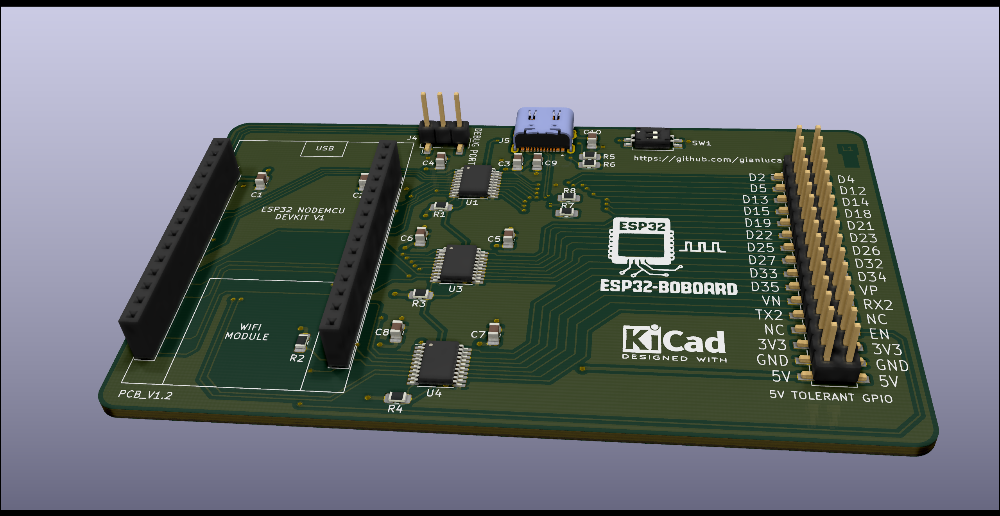
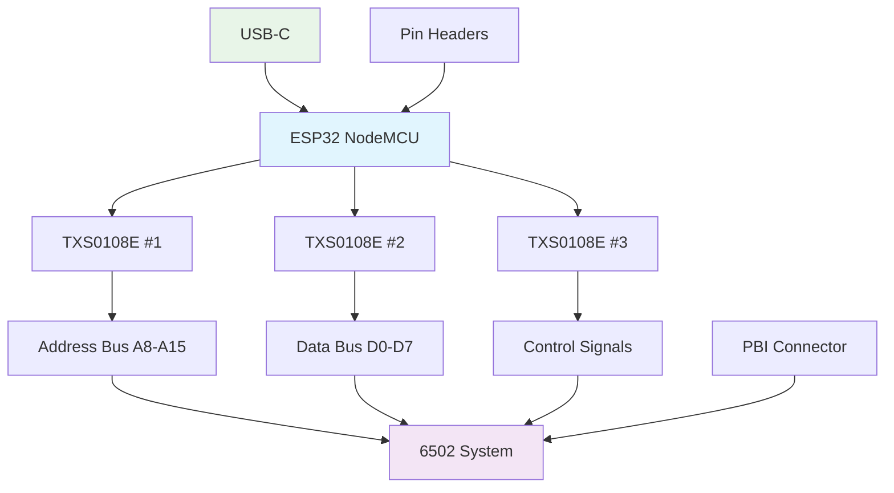
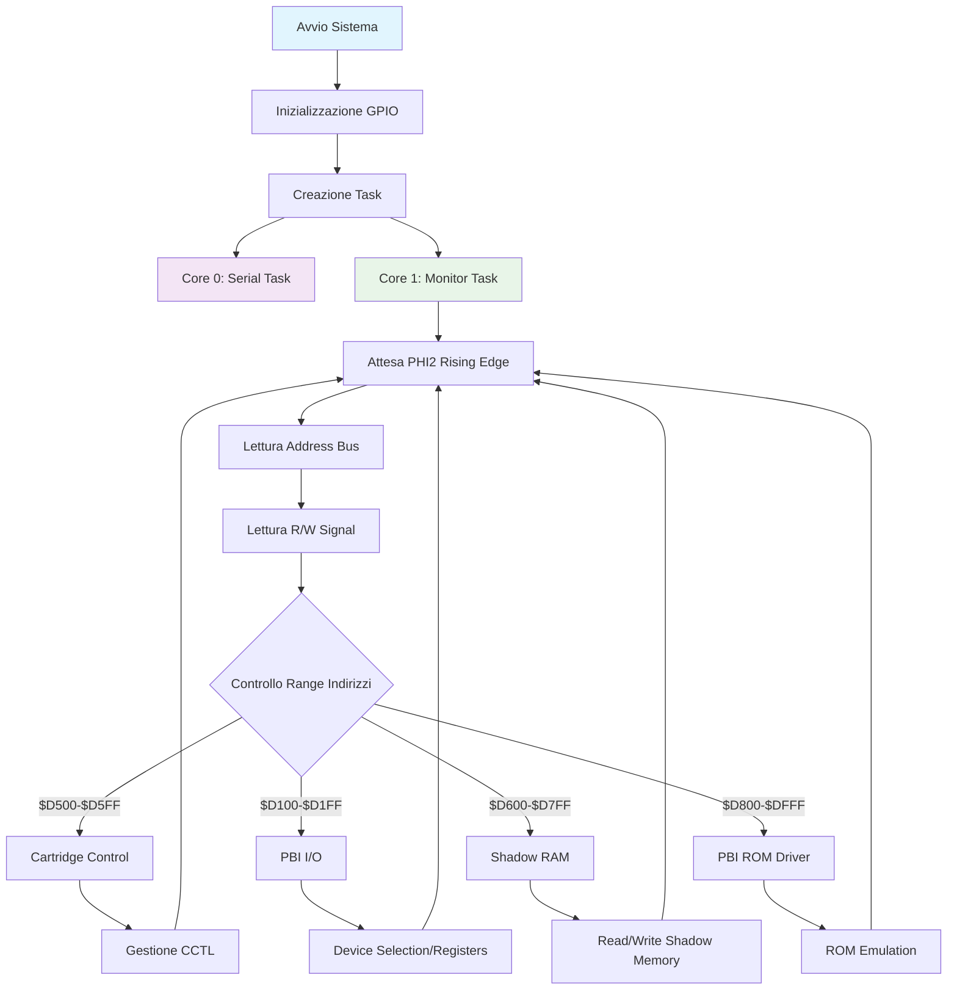
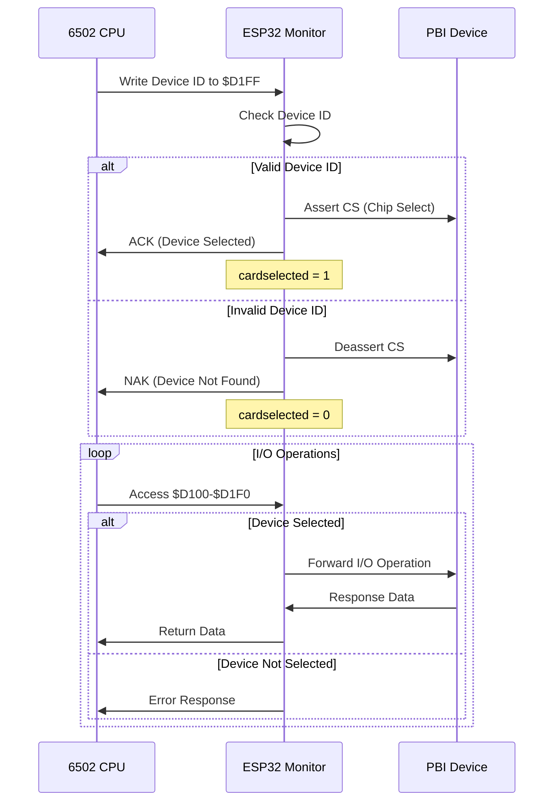
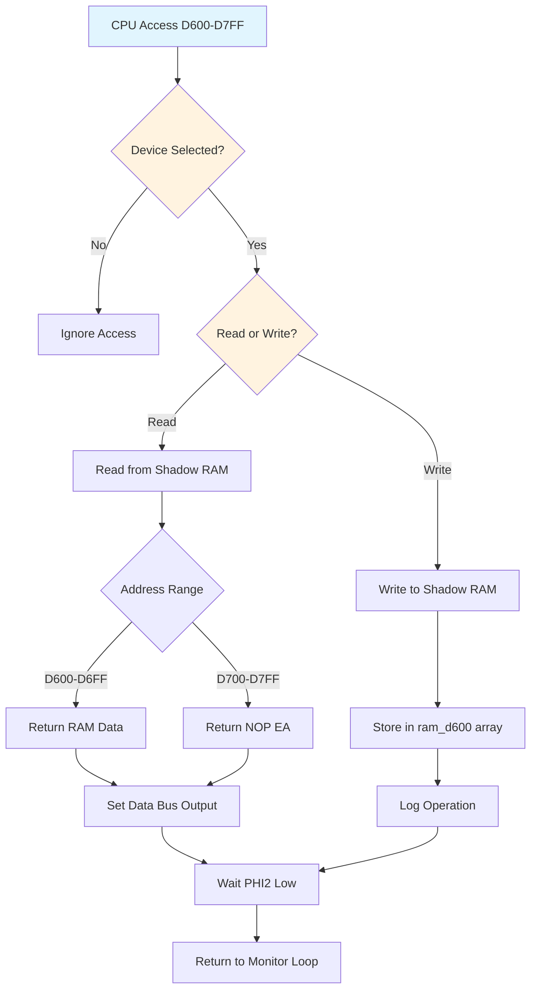

# ESP32-BOBOARD-5V

**ESP32 NodeMCU 5V Tolerant Breakout Board per Monitoraggio Bus 6502**



## 📋 Indice

- [Panoramica del Progetto](#panoramica-del-progetto)
- [Caratteristiche Principali](#caratteristiche-principali)
- [Specifiche Tecniche](#specifiche-tecniche)
- [Architettura Hardware](#architettura-hardware)
- [Firmware](#firmware)
- [Installazione e Setup](#installazione-e-setup)
- [Utilizzo](#utilizzo)
- [Diagrammi di Flusso](#diagrammi-di-flusso)
- [Tempistiche](#tempistiche)
- [File del Progetto](#file-del-progetto)
- [Produzione](#produzione)
- [Licenza](#licenza)
- [Contributi](#contributi)

## 🎯 Panoramica del Progetto

ESP32-BOBOARD-5V è una scheda breakout specializzata progettata per interfacciare un modulo ESP32 NodeMCU con sistemi basati su processore 6502, come l'Atari 8-bit. La scheda fornisce:

- **Tolleranza 5V** per tutti i pin GPIO
- **Monitoraggio del bus 6502** in tempo reale
- **Implementazione PBI (Parallel Bus Interface)** per Atari
- **Level shifting bidirezionale** per compatibilità 3.3V/5V
- **Connettori standard** per facile integrazione

### 🎮 Applicazioni Principali

- Monitoraggio e debug di sistemi 6502
- Implementazione di periferiche PBI per Atari
- Analisi del traffico del bus dati/indirizzi
- Emulazione di ROM e RAM esterne
- Sviluppo di cartucce intelligenti

## ✨ Caratteristiche Principali

### Hardware
- **ESP32 NodeMCU** compatibile (240MHz dual-core)
- **3x TXS0108E** level shifters bidirezionali
- **Tolleranza 5V** su tutti i pin GPIO
- **Connettore USB-C** per programmazione e alimentazione
- **Connettore PBI** standard per Atari
- **Pin header** per accesso completo ai GPIO
- **LED di stato** e pulsanti di controllo

### Firmware
- **Monitoraggio bus 6502** ad alta velocità
- **Dual-core processing** (Core 0: Serial, Core 1: Monitor)
- **Implementazione PBI completa** con device selection
- **Shadow RAM** per emulazione memoria
- **Debug output** colorato via seriale
- **Test automatico GPIO** per validazione hardware

## 🔧 Specifiche Tecniche

| Parametro | Valore |
|-----------|--------|
| **Microcontrollore** | ESP32-WROOM-32 |
| **Frequenza CPU** | 240 MHz (dual-core) |
| **Memoria Flash** | 4MB |
| **RAM** | 520KB |
| **GPIO disponibili** | 30 pin |
| **Level Shifters** | 3x TXS0108E (8-bit bidirezionali) |
| **Alimentazione** | 5V via USB-C o pin |
| **Logica I/O** | 3.3V/5V tolerant |
| **Dimensioni PCB** | 21.7mm x 21.7mm |
| **Layers** | 4 layer PCB |

### Pinout 6502 Bus

| Segnale | Pin ESP32 | Descrizione |
|---------|-----------|-------------|
| **A0-A1** | GPIO6, GPIO8 | Address Bus LSB (solo rev. finale) |
| **A2-A5** | GPIO21, GPIO27, GPIO33, GPIO32 | Address Bus |
| **A6-A7** | GPIO38, GPIO37 | Address Bus (solo rev. finale) |
| **A8-A15** | GPIO2, GPIO5, GPIO12, GPIO15, GPIO34, GPIO35, GPIO36, GPIO39 | Address Bus MSB |
| **D0-D7** | GPIO4, GPIO13, GPIO14, GPIO16, GPIO17, GPIO18, GPIO19, GPIO22 | Data Bus |
| **PHI2** | GPIO23 | Clock del processore |
| **R/W** | GPIO25 | Read/Write signal |
| **CS** | GPIO26 | Chip Select per FPGA |

### Segnali di Controllo (Rev. Finale)

| Segnale | Pin ESP32 | Descrizione |
|---------|-----------|-------------|
| **EXSEL** | GPIO11 | External memory select |
| **D1XX** | GPIO10 | PBI I/O space access |
| **CCTL** | GPIO20 | Cartridge control |
| **MPD** | GPIO7 | Math Pack ROM disable |

## 🏗️ Architettura Hardware

### Schema a Blocchi



### Level Shifting

La scheda utilizza tre TXS0108E per garantire la compatibilità tra i livelli logici 3.3V dell'ESP32 e i 5V del sistema 6502:

- **TXS0108E #1**: Address Bus A8-A15 + controlli
- **TXS0108E #2**: Data Bus D0-D7 (bidirezionale)
- **TXS0108E #3**: Address Bus A0-A7 + segnali aggiuntivi

## 💻 Firmware

### Architettura Software

Il firmware è basato su FreeRTOS e utilizza entrambi i core dell'ESP32:

- **Core 0**: Gestione comunicazione seriale e debug
- **Core 1**: Monitoraggio bus 6502 ad alta velocità

### Funzionalità Principali

#### 1. Monitoraggio Bus 6502
```cpp
// Lettura ottimizzata del bus indirizzi
static inline uint16_t read_address_bus(void) {
    uint32_t gpio_low = read_gpio_low();
    uint32_t gpio_high = read_gpio_high();
    // Combinazione bit per ricostruire indirizzo 16-bit
    return address_reconstruction;
}
```

#### 2. Implementazione PBI
- **Device Selection**: Registro $D1FF per selezione dispositivo
- **I/O Registers**: $D100-$D1F0 per comunicazione
- **Shadow RAM**: $D600-$D7FF per memoria condivisa
- **ROM Driver**: $D800-$DFFF per codice PBI

#### 3. Gestione Memoria

| Range Indirizzi | Funzione | Accesso |
|----------------|----------|---------|
| **$D100-$D1F0** | PBI I/O Registers | R/W |
| **$D1FF** | Device Selection | R/W |
| **$D500-$D5FF** | Cartridge Control | R/W |
| **$D600-$D7FF** | Shadow RAM | R/W |
| **$D800-$DFFF** | PBI ROM Driver | R |

### Modalità di Funzionamento

#### Modalità Test
```cpp
#define TEST  // Abilita modalità test GPIO
```
- Test automatico di tutti i pin GPIO
- Verifica connessioni hardware
- Output diagnostico colorato

#### Modalità Monitor
```cpp
#undef TEST  // Modalità normale
```
- Monitoraggio continuo bus 6502
- Implementazione protocollo PBI
- Gestione memoria shadow

## 🚀 Installazione e Setup

### Requisiti Hardware
- ESP32 NodeMCU (38 pin)
- Cavo USB-C per programmazione
- Sistema 6502 target (es. Atari 130XE)
- Connessioni bus secondo pinout

### Requisiti Software
- [PlatformIO](https://platformio.org/) o Arduino IDE
- ESP32 Arduino Core v2.0.14
- Driver USB-C per il sistema operativo

### Compilazione Firmware

1. **Clone del repository**:
```bash
git clone https://github.com/your-repo/ESP32-BOBOARD-5V.git
cd ESP32-BOBOARD-5V/firmware/6502_monitor
```

2. **Configurazione PlatformIO**:
```ini
[env:nodemcu-32s]
platform = espressif32
board = nodemcu-32s
framework = arduino
monitor_speed = 115200
board_build.f_cpu = 240000000
upload_speed = 921600
```

3. **Compilazione e upload**:
```bash
pio run --target upload
pio device monitor
```

### Configurazione Hardware

1. **Connessione ESP32**: Inserire il modulo NodeMCU nei socket
2. **Alimentazione**: Collegare USB-C o alimentazione 5V
3. **Bus 6502**: Collegare secondo il pinout specificato
4. **Test**: Eseguire modalità test per verifica connessioni

## 📊 Utilizzo

### Avvio Sistema

1. **Power-on**: Alimentare la scheda
2. **Monitor seriale**: Aprire terminale a 115200 baud
3. **Inizializzazione**: Attendere messaggio di ready
4. **Connessione 6502**: Collegare al sistema target

### Output Seriale

Il firmware produce output colorato per facilitare il debug:

```
🔵 6502 Bus Monitor Ready on Core 1
🟡 CCTL: Send $FF from $D500 to CPU
🟢 PBI I/O: Device $01 selected
🔴 PBI Read or Write @ $D150 address. Device must be selected first!
🟡 Shadow RAM: Received $42 to $D600 from CPU
```

### Comandi di Debug

Il sistema supporta diversi livelli di debug:
- `DBG_ERROR`: Solo errori critici
- `DBG_INFO`: Informazioni generali
- `DBG_VERBOSE`: Debug dettagliato
- `DBG_NOISY`: Tutti i messaggi

## 📈 Diagrammi di Flusso

### Flusso Principale del Monitor



### Protocollo PBI Device Selection



### Gestione Shadow RAM



## ⏱️ Tempistiche

### Timing Critici

| Operazione | Tempo | Note |
|------------|-------|------|
| **PHI2 Period** | ~1 MHz | Clock 6502 standard |
| **Address Setup** | <100ns | Prima del rising edge PHI2 |
| **Data Setup** | <200ns | Per operazioni di write |
| **Data Hold** | <100ns | Dopo falling edge PHI2 |
| **GPIO Read** | ~125ns | Lettura registri ESP32 |
| **Level Shift** | <10ns | Propagazione TXS0108E |

### Diagramma Temporale Bus 6502

```mermaid
gantt
    title Timing Diagram - 6502 Bus Cycle
    dateFormat X
    axisFormat %L
    
    section PHI2
    High Phase    :active, phi2h, 0, 500
    Low Phase     :phi2l, 500, 1000
    
    section Address Bus
    Address Valid :addr, 0, 900
    Address Hold  :addrh, 900, 1000
    
    section Data Bus (Read)
    Data Setup    :data, 100, 400
    Data Valid    :active, datav, 400, 800
    Data Hold     :datah, 800, 900
    
    section R/W Signal
    Read Cycle    :active, rw, 0, 1000
```



### Performance del Monitor

- **Frequenza campionamento**: ~4 MHz (limitata da ESP32)
- **Latenza risposta**: <1μs per operazioni PBI
- **Throughput seriale**: 115200 baud per debug
- **Utilizzo CPU**: ~80% Core 1, ~20% Core 0

## 📁 File del Progetto

### Struttura Directory

```
ESP32-BOBOARD-5V/
├── 📁 firmware/
│   └── 📁 6502_monitor/
│       ├── 📄 platformio.ini      # Configurazione PlatformIO
│       ├── 📁 src/
│       │   └── 📄 main.cpp        # Firmware principale
│       └── 📁 include/
│           └── 📄 pbi-driver.h    # Driver PBI ROM
├── 📁 schematics/
│   └── 📄 ESP32-BOBOARD-5V.pdf    # Schema elettrico
├── 📁 3D/
│   ├── 🖼️ ESP32-BOBOARD-5V.png    # Render 3D
│   ├── 🖼️ ESP32-BOBOARD-5V_TOP.png
│   ├── 🖼️ ESP32-BOBOARD-5V_BOTTOM.png
│   └── 📄 ESP32-BOBOARD-5V.step   # Modello 3D
├── 📁 production/
│   ├── 📄 *.gbl, *.gtl           # File Gerber
│   ├── 📄 *.drl                  # File drill
│   └── 📄 ESP32BOBOARD-5V-1.0.zip
├── 📁 ibom/
│   └── 📄 ibom.html              # Interactive BOM
├── 📄 ESP32-BOBOARD-5V.kicad_pcb  # PCB KiCad
├── 📄 ESP32-BOBOARD-5V.sch        # Schema KiCad
├── 📄 ESP32-BOBOARD-5V.csv        # Bill of Materials
└── 📄 README.md                   # Questo file
```

### File di Produzione

#### Bill of Materials (BOM)

| Componente | Quantità | Package | LCSC Part |
|------------|----------|---------|-----------|
| **TXS0108EPW** | 3 | TSSOP-20 | C17206 |
| **100µF Capacitor** | 9 | 0805 | C141660 |
| **100nF Capacitor** | 1 | 0805 | C840116 |
| **10kΩ Resistor** | 4 | 0805 | C84376 |
| **5.1kΩ Resistor** | 2 | 0805 | C27834 |
| **1% Precision Resistor** | 2 | 0805 | C328378 |
| **Pin Socket 1x15** | 2 | THT | - |
| **Pin Header 2x16** | 1 | SMD | C6332241 |
| **USB-C Connector** | 1 | SMD | C3197885 |
| **SPST Switch** | 1 | SMD | C319052 |

#### File Gerber
- **4-layer PCB** ottimizzato per segnali ad alta velocità
- **Impedenza controllata** per linee critiche
- **Ground planes** per riduzione EMI
- **Via stitching** per integrità del segnale

## 🏭 Produzione

### Specifiche PCB

| Parametro | Valore |
|-----------|--------|
| **Layers** | 4 |
| **Thickness** | 1.6mm |
| **Min Track** | 0.1mm |
| **Min Via** | 0.2mm |
| **Copper Weight** | 1oz (35μm) |
| **Surface Finish** | HASL Lead-Free |
| **Solder Mask** | Green |
| **Silkscreen** | White |

### Assembly

1. **SMD Components**: Assemblaggio automatico raccomandato
2. **THT Components**: Saldatura manuale pin headers
3. **Test**: Verifica continuità e test funzionale
4. **Programming**: Upload firmware di test

### Versioni

- **v1.1**: Versione prototipo (pin limitati)
- **v1.2**: Versione finale (tutti i pin disponibili)

## 📜 Licenza

Questo progetto è rilasciato sotto **GNU General Public License v3.0**.

```
ESP32-BOBOARD-5V - ESP32 NodeMCU 5V Tolerant Breakout Board
Copyright (C) 2024 RetroBitLab

This program is free software: you can redistribute it and/or modify
it under the terms of the GNU General Public License as published by
the Free Software Foundation, either version 3 of the License, or
(at your option) any later version.
```

Vedi il file [LICENSE](LICENSE) per i dettagli completi.

## 🤝 Contributi

I contributi sono benvenuti! Per contribuire:

1. **Fork** del repository
2. **Crea** un branch per la tua feature (`git checkout -b feature/AmazingFeature`)
3. **Commit** delle modifiche (`git commit -m 'Add some AmazingFeature'`)
4. **Push** al branch (`git push origin feature/AmazingFeature`)
5. **Apri** una Pull Request

### Aree di Contributo

- 🐛 **Bug fixes** e miglioramenti firmware
- 📚 **Documentazione** e tutorial
- 🔧 **Hardware** ottimizzazioni e varianti
- 🧪 **Testing** e validazione
- 🎨 **Examples** e progetti dimostrativi

### Reporting Issues

Per segnalare problemi, utilizzare il sistema di [Issues](../../issues) includendo:
- Descrizione dettagliata del problema
- Versione hardware e firmware
- Log seriali se disponibili
- Passi per riprodurre il problema

---

## 📞 Contatti

- **Progetto**: ESP32-BOBOARD-5V
- **Autore**: RetroBitLab
- **Repository**: [GitHub](https://github.com/your-repo/ESP32-BOBOARD-5V)
- **Documentazione**: [Wiki](../../wiki)

---

*Realizzato con ❤️ per la comunità retro-computing*