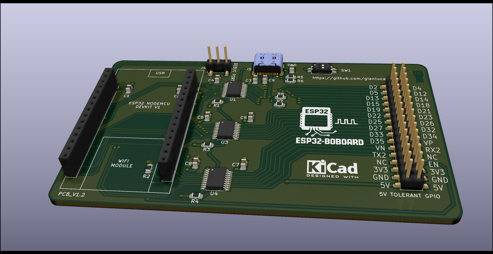
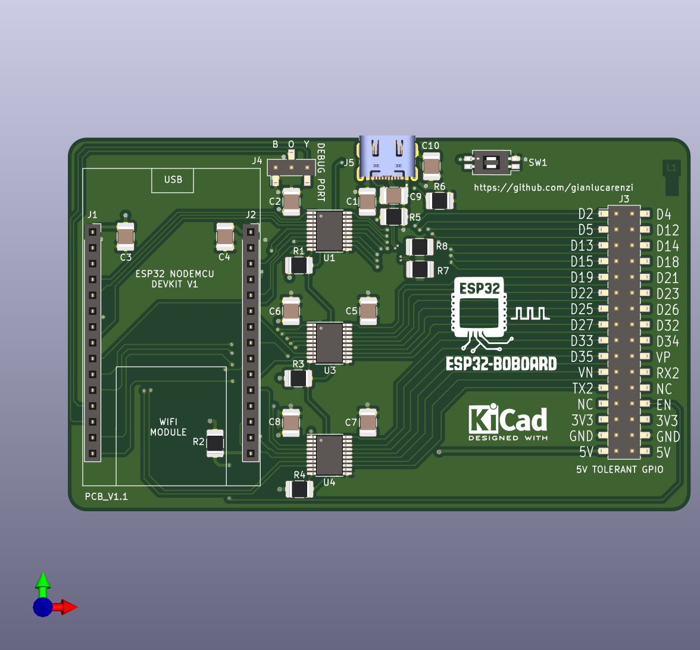
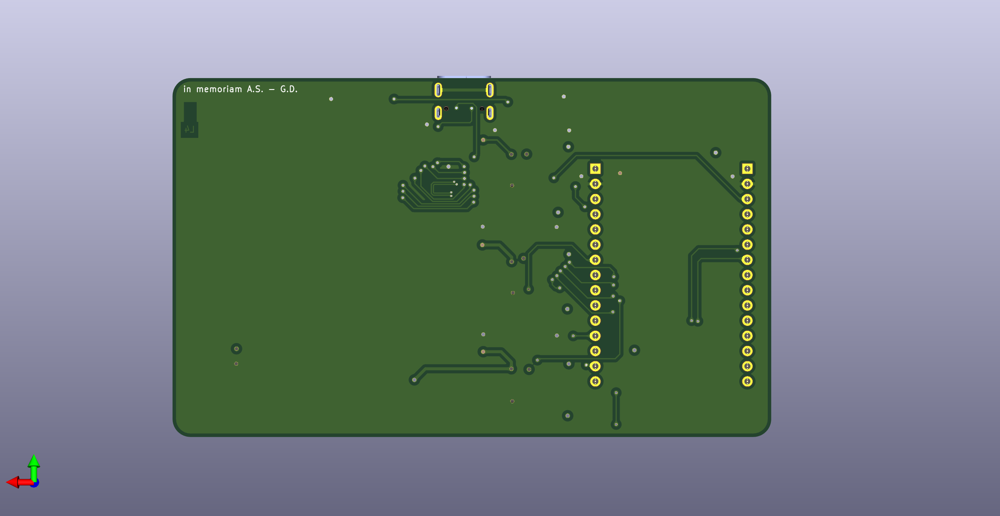
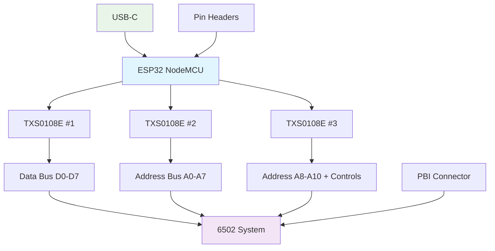
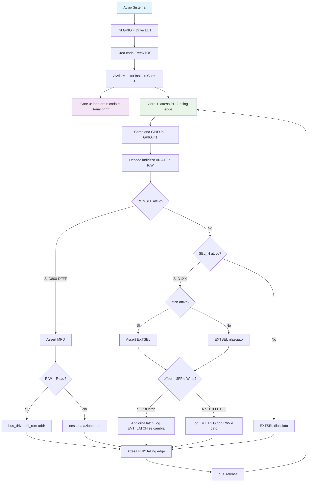
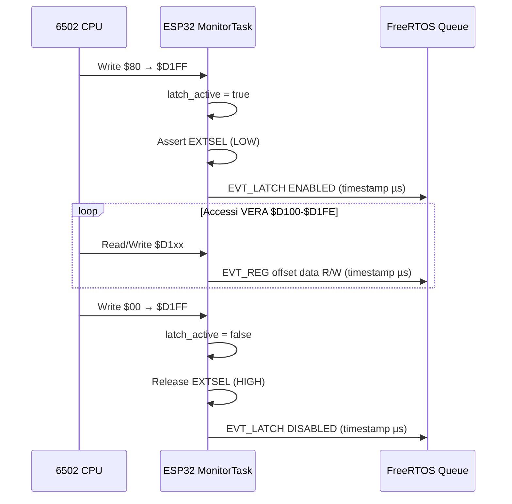

# ESP32-BOBOARD-5V

**ESP32 NodeMCU 5V Tolerant Breakout Board per Monitoraggio Bus 6502**

## 🌐 Language / Lingua

[](README.md)
[](README_EN.md)

---



## 📋 Indice

- [Panoramica del Progetto](#panoramica-del-progetto)
- [Caratteristiche Principali](#caratteristiche-principali)
- [Specifiche Tecniche](#specifiche-tecniche)
- [Visualizzazione 3D](#visualizzazione-3d)
- [Architettura Hardware](#architettura-hardware)
- [Firmware](#firmware)
- [Installazione e Setup](#installazione-e-setup)
- [Utilizzo](#utilizzo)
- [Diagrammi di Flusso](#diagrammi-di-flusso)
- [Tempistiche](#tempistiche)
- [File del Progetto](#file-del-progetto)
- [Produzione](#produzione)
- [Licenza](#licenza)
- [Contributi](#contributi)

## 🎯 Panoramica del Progetto

ESP32-BOBOARD-5V è una scheda breakout specializzata progettata per interfacciare un modulo ESP32 NodeMCU con sistemi basati su processore 6502, come l'Atari 8-bit. La scheda fornisce:

- **Tolleranza 5V** per tutti i pin GPIO
- **Monitoraggio del bus 6502** in tempo reale
- **Implementazione PBI (Parallel Bus Interface)** per Atari
- **Level shifting bidirezionale** per compatibilità 3.3V/5V
- **Connettori standard** per facile integrazione

### 🎮 Applicazioni Principali

- Monitoraggio e debug di sistemi 6502
- Implementazione di periferiche PBI per Atari
- Analisi del traffico del bus dati/indirizzi
- Emulazione di ROM e RAM esterne
- Sviluppo di cartucce intelligenti

## ✨ Caratteristiche Principali

### Hardware
- **ESP32 NodeMCU** compatibile (240MHz dual-core)
- **3x TXS0108E** level shifters bidirezionali
- **Tolleranza 5V** su tutti i pin GPIO
- **Connettore USB-C** per programmazione e alimentazione
- **Connettore PBI** standard per Atari
- **Pin header** per accesso completo ai GPIO
- **LED di stato** e pulsanti di controllo

### Firmware
- **PBI ROM Emulator** ($D800–$DFFF, 2 KB — decode completo A0-A10, nessun aliasing)
- **Dual-core processing** (Core 0: Serial/Log, Core 1: Monitor bus)
- **MPD** asserted durante accessi ROMSEL
- **EXTSEL** asserted durante accessi $D1XX con latch attivo
- **Latch interno** controllato via scrittura a $D1FF ($80 = enable, $00 = disable)
- **Coda FreeRTOS** (Core 1 → Core 0): log cambi stato latch VCS e ogni accesso $D100–$D1FE con timestamp in microsecondi

## 🔧 Specifiche Tecniche

| Parametro | Valore |
|-----------|--------|
| **Microcontrollore** | ESP32-WROOM-32 |
| **Frequenza CPU** | 240 MHz (dual-core) |
| **Memoria Flash** | 4MB |
| **RAM** | 520KB |
| **GPIO disponibili** | 30 pin |
| **Level Shifters** | 3x TXS0108E (8-bit bidirezionali) |
| **Alimentazione** | 5V via USB-C o pin |
| **Logica I/O** | 3.3V/5V tolerant |
| **Dimensioni PCB** | 21.7mm x 21.7mm |
| **Layers** | 4 layer PCB |

### Pinout 6502 Bus

| Segnale | Pin ESP32 | Descrizione |
|---------|-----------|-------------|
| **D0-D7** | GPIO4, GPIO5, GPIO13, GPIO14, GPIO16, GPIO17, GPIO18, GPIO19 | Data Bus (Bidirezionale) |
| **A0-A3** | GPIO34, GPIO35, GPIO36, GPIO39 | Address Bus LSB (Input Only) |
| **A4-A7** | GPIO32, GPIO33, GPIO21, GPIO27 | Address Bus |
| **A8-A10** | GPIO12, GPIO25, GPIO26 | Address Bus (decode completo 2 KB) |
| **PHI2** | GPIO2 | Clock 6502 (1.79 MHz) |
| **R/W** | GPIO15 | Read/Write |
| **SEL_N** | GPIO22 | Selezione $D1XX / CCTL (Active Low, Input) |
| **ROMSEL** | GPIO23 | Range $D800–$DFFF (Active Low, Input) |
| **EXTSEL** | GPIO3 (RX0) | Disabilita memoria interna Atari (Active Low, Output) |
| **MPD** | GPIO0 (BOOT) | Math Pack Disable (Active Low, Output) |

## 🎨 Visualizzazione 3D

### 📱 Viewer Online Interattivi

Visualizza i modelli 3D direttamente nel browser:

[](https://viewer.cadexchanger.com/)

[](https://3dviewer.net/?file=https://raw.githubusercontent.com/gianlucarenzi/esp32-boboard-5v/main/3D/ESP32-BOBOARD-5V.step)

[](https://viewer.autodesk.com/)


### 📥 Download File 3D

| Formato | Descrizione | Download |
|---------|-------------|----------|
| **STEP** | Modello CAD parametrico | [](3D/ESP32-BOBOARD-5V.step) |
| **WRL** | Modello VRML per rendering | [](3D/ESP32-BOBOARD-5V.wrl) |

### 🖼️ Galleria Immagini 3D

<table>
  <tr>
    <td align="center">
      
      <br/><b>Vista Isometrica</b>
    </td>
    <td align="center">
      
      <br/><b>Vista Superiore</b>
    </td>
  </tr>
  <tr>
    <td align="center">
      
      <br/><b>Vista Inferiore</b>
    </td>
    <td align="center">
      
      <br/><b><a href="schematics/ESP32-BOBOARD-5V.pdf">📄 Schema Elettrico</a></b>
    </td>
  </tr>
</table>

### 🛠️ Software Consigliati per Visualizzazione

| Software | Formato | Piattaforma | Gratuito |
|----------|---------|-------------|----------|
| **FreeCAD** | STEP, WRL | Windows, Linux, macOS | ✅ |
| **Fusion 360** | STEP | Windows, macOS | ✅ (Personal) |
| **Blender** | WRL | Windows, Linux, macOS | ✅ |
| **MeshLab** | WRL | Windows, Linux, macOS | ✅ |
| **CAD Exchanger Viewer** | STEP, WRL | Browser | ✅ |
| **3D Viewer Online** | STEP, WRL | Browser | ✅ |
| **Autodesk Viewer** | STEP | Browser | ✅ |

---

## 🏗️ Architettura Hardware

### Schema a Blocchi


```mermaid
flowchart TD
    A[ESP32 NodeMCU] --> B[TXS0108E #1]
    A --> C[TXS0108E #2] 
    A --> D[TXS0108E #3]
    
    B --> E[Data Bus D0-D7]
    C --> F[Address Bus A0-A7]
    D --> G[Address A8-A10 + Controls]
    
    E --> H[6502 System]
    F --> H
    G --> H
    
    I[USB-C] --> A
    J[Pin Headers] --> A
    K[PBI Connector] --> H
    
    style A fill:#e1f5fe
    style H fill:#f3e5f5
    style I fill:#e8f5e8
```

### Level Shifting

La scheda utilizza tre TXS0108E per garantire la compatibilità tra i livelli logici 3.3V dell'ESP32 e i 5V del sistema 6502:

- **TXS0108E #1**: Data Bus D0-D7 (bidirezionale)
- **TXS0108E #2**: Address Bus A0-A7
- **TXS0108E #3**: Address Bus A8-A10 + segnali di controllo (PHI2, R/W, SEL\_N, ROMSEL, EXTSEL, MPD)

## 💻 Firmware

### Architettura Software

Il firmware è basato su FreeRTOS e utilizza entrambi i core dell'ESP32:

- **Core 0**: Gestione comunicazione seriale e debug
- **Core 1**: Monitoraggio bus 6502 ad alta velocità

### Funzionalità Principali

#### 1. Monitoraggio Bus 6502
```cpp
// Lettura ottimizzata del bus indirizzi
static inline uint16_t read_address_bus(void) {
    uint32_t gpio_low = read_gpio_low();
    uint32_t gpio_high = read_gpio_high();
    // Combinazione bit per ricostruire indirizzo 16-bit
    return address_reconstruction;
}
```

#### 2. Implementazione PBI

| Range Indirizzi | Funzione | Note |
|----------------|----------|------|
| **$D100–$D11F** | Registri VERA (accesso via EXTSEL) | Solo con latch attivo |
| **$D1FF** | Latch control (W: $80=on, $00=off) | Solo PBI mode |
| **$D800–$DFFF** | PBI ROM 2 KB — driver VERA X16 | A0-A10 decodificati, nessun aliasing |

#### 3. Sorgenti 6502 (ROM)

| File | Descrizione |
|------|-------------|
| `6502/src/vera_pbi_handler.s` | Driver PBI ROM per scheda VERA X16. Intestazione standard Earl Rice ($D800–$D81C), handler CIO, vettori OPEN/CLOSE/GET/PUT/STATUS/SPECIAL, init VERA. |
| `6502/src/vera_common.inc` | Simboli condivisi: indirizzi registri VERA (`VERA_ADDR_L/M/H`, `VERA_DATA0/1`, `VERA_CTRL`, …), costanti PBI (`PBI_ADDR=$D100`, `PBI_LATCH=$D1FF`), layout schermo. |
| `6502/pbi-driver.ld` | Linker script: segmento `ROM` origin `$D800`, size `$0800` (2 KB). |
| `include/pbi-driver.h` | Array C `pbi_driver[]` generato automaticamente dal Makefile — non modificare a mano. |

### Modalità di Funzionamento

#### Modalità PBI (Default)
```ini
-D BUS_MODE=0  ; BUS_MODE_PBI
```
- Emulazione dispositivo PBI Atari
- ROMSEL ($D800–$DFFF): assert MPD, serve byte ROM su letture (A0-A10)
- SEL_N ($D1XX): assert EXTSEL quando latch attivo
- Latch VCS: abilitato da `$80` a $D1FF, disabilitato da `$00`

#### Modalità CCTL (Cartridge)
```ini
-D BUS_MODE=1  ; BUS_MODE_CCTL
```
- Modalità Cartridge Control semplificata
- Latch sempre attivo (EXTSEL sempre asserted su $D1XX)
- Non gestisce $D1FF come controllo latch

## 🚀 Installazione e Setup

### Requisiti Hardware
- ESP32 NodeMCU (38 pin)
- Cavo USB-C per programmazione
- Sistema 6502 target (es. Atari 130XE)
- Connessioni bus secondo pinout

### Requisiti Software
- [PlatformIO](https://platformio.org/) o Arduino IDE
- ESP32 Arduino Core v2.0.14
- Driver USB-C per il sistema operativo

### Compilazione Firmware

1. **Clone del repository**:
```bash
git clone https://github.com/gianlucarenzi/esp32-boboard-5v.git
cd ESP32-BOBOARD-5V/firmware/6502_monitor
```

2. **Configurazione PlatformIO**:
```ini
[env:nodemcu-32s]
platform = espressif32
board = nodemcu-32s
framework = arduino
monitor_speed = 115200
board_build.f_cpu = 240000000
upload_speed = 921600
```

3. **Compilazione e upload**:
```bash
pio run --target upload
pio device monitor
```

### Configurazione Hardware

1. **Connessione ESP32**: Inserire il modulo NodeMCU nei socket
2. **Alimentazione**: Collegare USB-C o alimentazione 5V
3. **Bus 6502**: Collegare secondo il pinout specificato
4. **Test**: Eseguire modalità test per verifica connessioni

## 📊 Utilizzo

### Avvio Sistema

1. **Power-on**: Alimentare la scheda
2. **Monitor seriale**: Aprire terminale a 115200 baud
3. **Inizializzazione**: Attendere messaggio di ready
4. **Connessione 6502**: Collegare al sistema target

### Output Seriale

Il firmware stampa su Core 0 ogni evento loggato da Core 1 via coda FreeRTOS.
Il formato è `[secondi.microsecondi]`:

```
[6502_monitor] PBI ROM Emulator booting...
[6502_monitor] Running.
[6502_monitor] VCS=OFF  Latch=DISABLED
[    0.012345] [VCS ] Latch ENABLED  ($80 written to $D1FF)
[    0.012346] [D100 - VERA_ADDR_L          ] R $00
[    0.012390] [D103 - VERA_DATA0           ] W $FF
[    1.234567] [D104 - VERA_DATA1           ] W $00
[    1.234600] [VCS ] Latch DISABLED ($00 written to $D1FF)
```

- `[VCS ]` — cambio di stato del latch: `ENABLED` / `DISABLED`
- `[D1xx - NOME_REGISTRO]` — accesso a registro VERA con nome simbolico: `R` = lettura, `W` = scrittura
- I registri $09–$0C sono muxati da DCSEL: il logger traccia ogni scrittura a `VERA_CTRL` ($D105, bit [2:1]) per risolvere il nome corretto
- Il timestamp è catturato in Core 1 al momento del ciclo di bus (`esp_timer_get_time()`)
- Gli eventi persi quando la coda è piena vengono scartati senza bloccare il bus handler

## 📈 Diagrammi di Flusso

### Flusso Principale del Monitor


```mermaid
flowchart TD
    A[Avvio Sistema] --> B[Init GPIO + Drive LUT]
    B --> C[Crea coda FreeRTOS]
    C --> D[Avvia MonitorTask su Core 1]
    D --> E[Core 0: loop drain coda e Serial.printf]
    D --> F[Core 1: attesa PHI2 rising edge]

    F --> G[Campiona GPIO.in / GPIO.in1]
    G --> H[Decode indirizzo A0-A10 e R/W]
    H --> I{ROMSEL attivo?}

    I -->|Sì D800-DFFF| J[Assert MPD]
    J --> K{R/W = Read?}
    K -->|Sì| L[bus_drive pbi_rom addr]
    K -->|No| M[nessuna azione dati]

    I -->|No| N{SEL_N attivo?}
    N -->|Sì D1XX| O{latch attivo?}
    O -->|Sì| P[Assert EXTSEL]
    O -->|No| Q[EXTSEL rilasciato]
    P --> R{offset = $FF e Write?}
    Q --> R
    R -->|Sì PBI latch| S[Aggiorna latch, log EVT_LATCH se cambia]
    R -->|No D100-D1FE| T[log EVT_REG con R/W e dato]
    N -->|No| U[EXTSEL rilasciato]

    L --> V[Attesa PHI2 falling edge]
    M --> V
    S --> V
    T --> V
    U --> V
    V --> W[bus_release]
    W --> F

    style A fill:#e1f5fe
    style E fill:#f3e5f5
    style F fill:#e8f5e8
```

### Protocollo Latch VCS (PBI Mode)


```mermaid
sequenceDiagram
    participant CPU as 6502 CPU
    participant ESP as ESP32 MonitorTask
    participant Q  as FreeRTOS Queue

    CPU->>ESP: Write $80 → $D1FF
    ESP->>ESP: latch_active = true
    ESP->>ESP: Assert EXTSEL (LOW)
    ESP->>Q: EVT_LATCH ENABLED (timestamp µs)

    loop Accessi VERA $D100-$D1FE
        CPU->>ESP: Read/Write $D1xx
        ESP->>Q: EVT_REG offset data R/W (timestamp µs)
    end

    CPU->>ESP: Write $00 → $D1FF
    ESP->>ESP: latch_active = false
    ESP->>ESP: Release EXTSEL (HIGH)
    ESP->>Q: EVT_LATCH DISABLED (timestamp µs)
```

## ⏱️ Tempistiche

### Timing Critici

| Operazione | Tempo | Note |
|------------|-------|------|
| **PHI2 Period** | 1.77 MHz (PAL) / 1.79 MHz (NTSC) | Clock Atari 6502 |
| **Address Setup** | <100ns | Prima del rising edge PHI2 |
| **Data Setup** | <200ns | Per operazioni di write |
| **Data Hold** | <100ns | Dopo falling edge PHI2 |
| **GPIO Read** | ~125ns | Lettura registri ESP32 |
| **Level Shift** | <10ns | Propagazione TXS0108E |

### Diagramma Temporale Bus 6502


```mermaid
gantt
    title Timing Diagram - 6502 Bus Cycle
    dateFormat X
    axisFormat %L
    
    section PHI2
    High Phase    :active, phi2h, 0, 500
    Low Phase     :phi2l, 500, 1000
    
    section Address Bus
    Address Valid :addr, 0, 900
    Address Hold  :addrh, 900, 1000
    
    section Data Bus (Read)
    Data Setup    :data, 100, 400
    Data Valid    :active, datav, 400, 800
    Data Hold     :datah, 800, 900
    
    section R/W Signal
    Read Cycle    :active, rw, 0, 1000
```

### Performance del Monitor

- **Frequenza campionamento**: ~4 MHz (limitata da ESP32)
- **Latenza risposta**: <1μs per operazioni PBI
- **Throughput seriale**: 115200 baud per debug
- **Utilizzo CPU**: ~80% Core 1, ~20% Core 0
- **Compatibilità**: Atari PAL (1.77 MHz) e NTSC (1.79 MHz)

## 📁 File del Progetto

### Struttura Directory

```
ESP32-BOBOARD-5V/
├── 📁 firmware/
│   └── 📁 6502_monitor/
│       ├── 📄 platformio.ini          # Configurazione PlatformIO
│       ├── 📄 pre_build.py            # Script pre-build: assembla il ROM 6502
│       ├── 📁 src/
│       │   └── 📄 main.cpp            # Firmware ESP32 (PBI ROM emulator)
│       ├── 📁 include/
│       │   └── 📄 pbi-driver.h        # Array C generato dal ROM 6502 (auto)
│       └── 📁 6502/
│           ├── 📄 Makefile            # Assembla vera_pbi_handler.s → pbi-driver.h
│           ├── 📄 pbi-driver.ld       # Linker script (origin $D800, size 2 KB)
│           └── 📁 src/
│               ├── 📄 vera_pbi_handler.s  # PBI ROM driver per scheda VERA X16
│               └── 📄 vera_common.inc     # Simboli condivisi: registri VERA, costanti PBI
├── 📁 schematics/
│   └── 📄 ESP32-BOBOARD-5V.pdf    # Schema elettrico
├── 📁 3D/
│   ├── 🖼️ ESP32-BOBOARD-5V.png    # Render 3D
│   ├── 🖼️ ESP32-BOBOARD-5V_TOP.png
│   ├── 🖼️ ESP32-BOBOARD-5V_BOTTOM.png
│   └── 📄 ESP32-BOBOARD-5V.step   # Modello 3D
├── 📁 production/
│   ├── 📄 *.gbl, *.gtl           # File Gerber
│   ├── 📄 *.drl                  # File drill
│   └── 📄 ESP32BOBOARD-5V-1.0.zip
├── 📁 ibom/
│   └── 📄 ibom.html              # Interactive BOM
├── 📄 ESP32-BOBOARD-5V.kicad_pcb  # PCB KiCad
├── 📄 ESP32-BOBOARD-5V.sch        # Schema KiCad
├── 📄 ESP32-BOBOARD-5V.csv        # Bill of Materials
└── 📄 README.md                   # Questo file
```

### File di Produzione

#### Bill of Materials (BOM)

| Componente | Quantità | Package | LCSC Part |
|------------|----------|---------|-----------|
| **TXS0108EPW** | 3 | TSSOP-20 | C17206 |
| **100µF Capacitor** | 9 | 0805 | C141660 |
| **100nF Capacitor** | 1 | 0805 | C840116 |
| **10kΩ Resistor** | 4 | 0805 | C84376 |
| **5.1kΩ Resistor** | 2 | 0805 | C27834 |
| **1% Precision Resistor** | 2 | 0805 | C328378 |
| **Pin Socket 1x15** | 2 | THT | - |
| **Pin Header 2x16** | 1 | SMD | C6332241 |
| **USB-C Connector** | 1 | SMD | C3197885 |
| **SPST Switch** | 1 | SMD | C319052 |

#### File Gerber
- **4-layer PCB** ottimizzato per segnali ad alta velocità
- **Impedenza controllata** per linee critiche
- **Ground planes** per riduzione EMI
- **Via stitching** per integrità del segnale

## 🏭 Produzione

### Specifiche PCB

| Parametro | Valore |
|-----------|--------|
| **Layers** | 4 |
| **Thickness** | 1.6mm |
| **Min Track** | 0.1mm |
| **Min Via** | 0.2mm |
| **Copper Weight** | 1oz (35μm) |
| **Surface Finish** | HASL Lead-Free |
| **Solder Mask** | Green |
| **Silkscreen** | White |

### Assembly

1. **SMD Components**: Assemblaggio automatico raccomandato
2. **THT Components**: Saldatura manuale pin headers
3. **Test**: Verifica continuità e test funzionale
4. **Programming**: Upload firmware di test

## 📜 Licenza

Questo progetto è rilasciato sotto **GNU General Public License v3.0**.

```
ESP32-BOBOARD-5V - ESP32 NodeMCU 5V Tolerant Breakout Board
Copyright (C) 2024 RetroBitLab

This program is free software: you can redistribute it and/or modify
it under the terms of the GNU General Public License as published by
the Free Software Foundation, either version 3 of the License, or
(at your option) any later version.
```

Vedi il file [LICENSE](LICENSE) per i dettagli completi.

## 🤝 Contributi

I contributi sono benvenuti! Per contribuire:

1. **Fork** del repository
2. **Crea** un branch per la tua feature (`git checkout -b feature/AmazingFeature`)
3. **Commit** delle modifiche (`git commit -m 'Add some AmazingFeature'`)
4. **Push** al branch (`git push origin feature/AmazingFeature`)
5. **Apri** una Pull Request

### Aree di Contributo

- 🐛 **Bug fixes** e miglioramenti firmware
- 📚 **Documentazione** e tutorial
- 🔧 **Hardware** ottimizzazioni e varianti
- 🧪 **Testing** e validazione
- 🎨 **Examples** e progetti dimostrativi

### Reporting Issues

Per segnalare problemi, utilizzare il sistema di [Issues](../../issues) includendo:
- Descrizione dettagliata del problema
- Versione hardware e firmware
- Log seriali se disponibili
- Passi per riprodurre il problema

---

## 📞 Contatti

- **Progetto**: ESP32-BOBOARD-5V
- **Autore**: RetroBitLab
Repository: [GitHub](https://github.com/gianlucarenzi/esp32-boboard-5v)
- **Documentazione**: [Wiki](../../wiki)

---

*Realizzato con ❤️ per la comunità retro-computing*