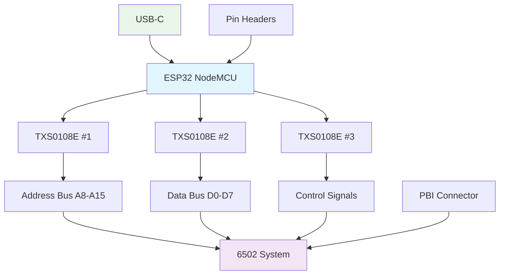
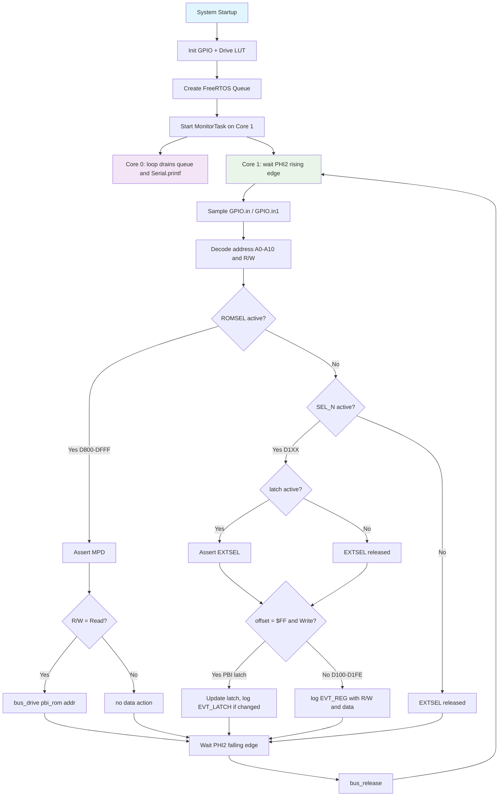
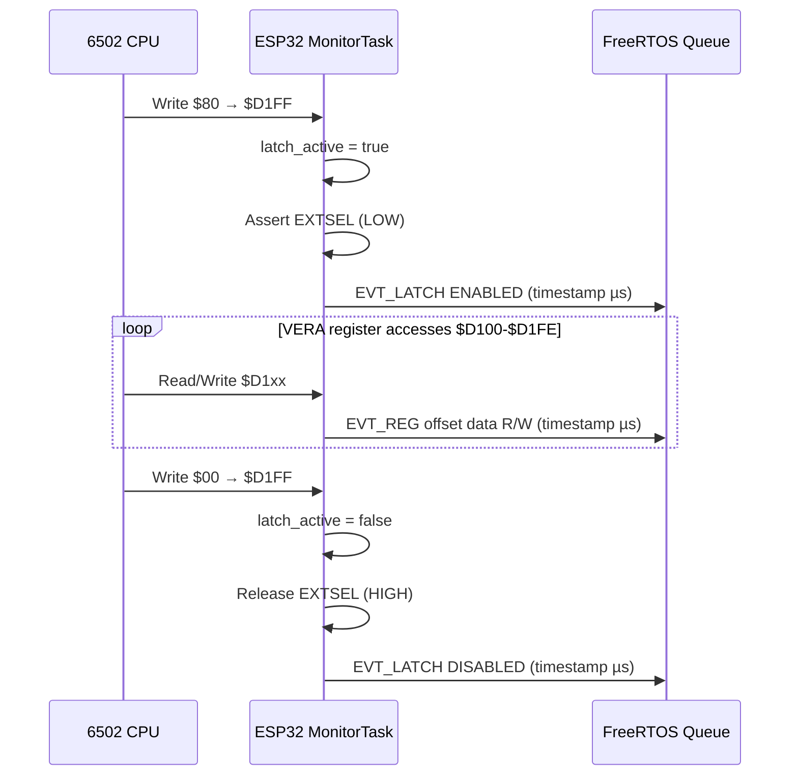

# ESP32-BOBOARD-5V

**ESP32 NodeMCU 5V Tolerant Breakout Board for 6502 Bus Monitoring**

## 🌐 Language / Lingua

[](README.md)
[](README_EN.md)

---


## 📋 Table of Contents

- [Project Overview](#project-overview)
- [Key Features](#key-features)
- [Technical Specifications](#technical-specifications)
- [3D Visualization](#3d-visualization)
- [Hardware Architecture](#hardware-architecture)
- [Firmware](#firmware)
- [Installation and Setup](#installation-and-setup)
- [Usage](#usage)
- [Flow Diagrams](#flow-diagrams)
- [Timing](#timing)
- [Project Files](#project-files)
- [Production](#production)
- [License](#license)
- [Contributing](#contributing)

## 🎯 Project Overview

ESP32-BOBOARD-5V is a specialized breakout board designed to interface an ESP32 NodeMCU module with 6502-based systems, such as the Atari 8-bit computers. The board provides:

- **5V tolerance** for all GPIO pins
- **Real-time 6502 bus monitoring**
- **PBI (Parallel Bus Interface) implementation** for Atari
- **Bidirectional level shifting** for 3.3V/5V compatibility
- **Standard connectors** for easy integration

### 🎮 Main Applications

- Monitoring and debugging 6502 systems
- PBI peripheral implementation for Atari
- Data/address bus traffic analysis
- External ROM and RAM emulation
- Smart cartridge development

## ✨ Key Features

### Hardware
- **ESP32 NodeMCU** compatible (240MHz dual-core)
- **3x TXS0108E** bidirectional level shifters
- **5V tolerance** on all GPIO pins
- **USB-C connector** for programming and power
- **Standard PBI connector** for Atari
- **Pin headers** for complete GPIO access
- **Status LEDs** and control buttons

### Firmware
- **PBI ROM Emulator** ($D800–$DFFF, 2 KB — full A0-A10 decode, no aliasing)
- **Dual-core processing** (Core 0: Serial/Log, Core 1: Monitor bus)
- **MPD** asserted on ROMSEL access
- **EXTSEL** asserted on $D1XX access when internal latch is active
- **Internal latch** controlled via $D1FF write ($80 = enable, $00 = disable)
- **FreeRTOS queue** (Core 1 → Core 0): logs VCS latch state changes and every $D100–$D1FE access with microsecond timestamps

## 🔧 Technical Specifications

| Parameter | Value |
|-----------|-------|
| **Microcontroller** | ESP32-WROOM-32 |
| **CPU Frequency** | 240 MHz (dual-core) |
| **Flash Memory** | 4MB |
| **RAM** | 520KB |
| **Available GPIO** | 30 pins |
| **Level Shifters** | 3x TXS0108E (8-bit bidirectional) |
| **Power Supply** | 5V via USB-C or pins |
| **I/O Logic** | 3.3V/5V tolerant |
| **PCB Dimensions** | 21.7mm x 21.7mm |
| **Layers** | 4 layer PCB |

### 6502 Bus Pinout

| Signal | ESP32 Pin | Description |
|---------|-----------|-------------|
| **D0-D7** | GPIO4, GPIO5, GPIO13, GPIO14, GPIO16, GPIO17, GPIO18, GPIO19 | Data Bus (Bidirectional) |
| **A0-A3** | GPIO34, GPIO35, GPIO36, GPIO39 | Address Bus LSB (Input Only) |
| **A4-A7** | GPIO32, GPIO33, GPIO21, GPIO27 | Address Bus |
| **A8-A10** | GPIO12, GPIO25, GPIO26 | Address Bus (full 2 KB decode) |
| **PHI2** | GPIO2 | 6502 clock (1.79 MHz) |
| **R/W** | GPIO15 | Read/Write |
| **SEL_N** | GPIO22 | $D1XX / CCTL selection (Active Low, Input) |
| **ROMSEL** | GPIO23 | $D800–$DFFF range (Active Low, Input) |
| **EXTSEL** | GPIO3 (RX0) | Disable Atari internal memory (Active Low, Output) |
| **MPD** | GPIO0 (BOOT) | Math Pack Disable (Active Low, Output) |

## 🎨 3D Visualization

### 📱 Interactive Online Viewers

View 3D models directly in your browser:

[](https://viewer.cadexchanger.com/)

[](https://3dviewer.net/?file=https://raw.githubusercontent.com/gianlucarenzi/esp32-boboard-5v/main/3D/ESP32-BOBOARD-5V.step)

[](https://viewer.autodesk.com/)


### 📥 Download 3D Files

| Format | Description | Download |
|---------|-------------|----------|
| **STEP** | Parametric CAD model | [](3D/ESP32-BOBOARD-5V.step) |
| **WRL** | VRML model for rendering | [](3D/ESP32-BOBOARD-5V.wrl) |

### 🖼️ 3D Image Gallery

<table>
  <tr>
    <td align="center">
      
      <br/><b>Isometric View</b>
    </td>
    <td align="center">
      
      <br/><b>Top View</b>
    </td>
  </tr>
  <tr>
    <td align="center">
      
      <br/><b>Bottom View</b>
    </td>
    <td align="center">
      
      <br/><b><a href="schematics/ESP32-BOBOARD-5V.pdf">📄 Electrical Schematic</a></b>
    </td>
  </tr>
</table>

### 🛠️ Recommended Software for Visualization

| Software | Format | Platform | Free |
|----------|---------|-------------|----------|
| **FreeCAD** | STEP, WRL | Windows, Linux, macOS | ✅ |
| **Fusion 360** | STEP | Windows, macOS | ✅ (Personal) |
| **Blender** | WRL | Windows, Linux, macOS | ✅ |
| **MeshLab** | WRL | Windows, Linux, macOS | ✅ |
| **CAD Exchanger Viewer** | STEP, WRL | Browser | ✅ |
| **3D Viewer Online** | STEP, WRL | Browser | ✅ |
| **Autodesk Viewer** | STEP | Browser | ✅ |

---

## 🏗️ Hardware Architecture

### Block Diagram


```mermaid
flowchart TD
    A[ESP32 NodeMCU] --> B[TXS0108E #1]
    A --> C[TXS0108E #2] 
    A --> D[TXS0108E #3]
    
    B --> E[Address Bus A8-A15]
    C --> F[Data Bus D0-D7]
    D --> G[Control Signals]
    
    E --> H[6502 System]
    F --> H
    G --> H
    
    I[USB-C] --> A
    J[Pin Headers] --> A
    K[PBI Connector] --> H
    
    style A fill:#e1f5fe
    style H fill:#f3e5f5
    style I fill:#e8f5e8
```

### Level Shifting

The board uses three TXS0108E to ensure compatibility between ESP32's 3.3V logic levels and the 6502 system's 5V:

- **TXS0108E #1**: Address Bus A8-A15 + controls
- **TXS0108E #2**: Data Bus D0-D7 (bidirectional)
- **TXS0108E #3**: Address Bus A0-A7 + additional signals

## 💻 Firmware

### Software Architecture

The firmware is based on FreeRTOS and uses both ESP32 cores:

- **Core 0**: Serial communication and debug management
- **Core 1**: High-speed 6502 bus monitoring

### Main Features

#### 1. 6502 Bus Monitoring
```cpp
// Optimized address bus reading
static inline uint16_t read_address_bus(void) {
    uint32_t gpio_low = read_gpio_low();
    uint32_t gpio_high = read_gpio_high();
    // Bit combination to reconstruct 16-bit address
    return address_reconstruction;
}
```

#### 2. PBI Implementation

| Address Range | Function | Notes |
|----------------|----------|-------|
| **$D100–$D11F** | VERA registers (accessed via EXTSEL) | Latch must be active |
| **$D1FF** | Latch control (W: $80=on, $00=off) | PBI mode only |
| **$D800–$DFFF** | PBI ROM 2 KB — VERA X16 driver | A0-A10 decoded, no aliasing |

#### 3. 6502 ROM Sources

| File | Description |
|------|-------------|
| `6502/src/vera_pbi_handler.s` | PBI ROM driver for the VERA X16 card. Standard Earl Rice header ($D800–$D81C), CIO handler, OPEN/CLOSE/GET/PUT/STATUS/SPECIAL vectors, VERA init. |
| `6502/src/vera_common.inc` | Shared symbols: VERA register addresses (`VERA_ADDR_L/M/H`, `VERA_DATA0/1`, `VERA_CTRL`, …), PBI constants (`PBI_ADDR=$D100`, `PBI_LATCH=$D1FF`), screen layout. |
| `6502/pbi-driver.ld` | Linker script: `ROM` segment origin `$D800`, size `$0800` (2 KB). |
| `include/pbi-driver.h` | C array `pbi_driver[]` auto-generated by the Makefile — do not edit manually. |

### Operating Modes

#### PBI Mode (Default)
```ini
-D BUS_MODE=0  ; BUS_MODE_PBI
```
- Atari PBI device emulation
- ROMSEL ($D800–$DFFF): asserts MPD, serves ROM bytes on reads (A0-A10)
- SEL_N ($D1XX): asserts EXTSEL when latch is active
- VCS latch: enabled by writing `$80` to $D1FF, disabled by `$00`

#### CCTL Mode (Cartridge)
```ini
-D BUS_MODE=1  ; BUS_MODE_CCTL
```
- Simplified Cartridge Control mode
- Latch always active (EXTSEL always asserted on $D1XX)
- $D1FF is not treated as latch control

## 🚀 Installation and Setup

### Hardware Requirements
- ESP32 NodeMCU (38 pin)
- USB-C cable for programming
- Target 6502 system (e.g. Atari 130XE)
- Bus connections according to pinout

### Software Requirements
- [PlatformIO](https://platformio.org/) or Arduino IDE
- ESP32 Arduino Core v2.0.14
- USB-C drivers for operating system

### Firmware Compilation

1. **Repository clone**:
```bash
git clone https://github.com/gianlucarenzi/esp32-boboard-5v.git
cd ESP32-BOBOARD-5V/firmware/6502_monitor
```

2. **PlatformIO configuration**:
```ini
[env:nodemcu-32s]
platform = espressif32
board = nodemcu-32s
framework = arduino
monitor_speed = 115200
board_build.f_cpu = 240000000
upload_speed = 921600
```

3. **Compilation and upload**:
```bash
pio run --target upload
pio device monitor
```

### Hardware Configuration

1. **ESP32 connection**: Insert NodeMCU module into sockets
2. **Power**: Connect USB-C or 5V power supply
3. **6502 Bus**: Connect according to specified pinout
4. **Test**: Run test mode to verify connections

## 📊 Usage

### System Startup

1. **Power-on**: Power up the board
2. **Serial monitor**: Open terminal at 115200 baud
3. **Initialization**: Wait for ready message
4. **6502 connection**: Connect to target system

### Serial Output

Core 0 drains the FreeRTOS queue sent by Core 1 and prints each event.
Timestamp format is `[seconds.microseconds]`:

```
[6502_monitor] PBI ROM Emulator booting...
[6502_monitor] Running.
[6502_monitor] VCS=OFF  Latch=DISABLED
[    0.012345] [VCS ] Latch ENABLED  ($80 written to $D1FF)
[    0.012346] [D100] R $00
[    0.012390] [D103] W $FF
[    1.234567] [D104] W $00
[    1.234600] [VCS ] Latch DISABLED ($00 written to $D1FF)
```

- `[VCS ]` — latch state change: `ENABLED` / `DISABLED`
- `[D1xx]` — VERA register access: `R` = read, `W` = write
- Timestamp captured in Core 1 at the exact bus cycle (`esp_timer_get_time()`)
- Events dropped when queue is full — the bus handler is never blocked

## 📈 Flow Diagrams

### Main Monitor Flow


```mermaid
flowchart TD
    A[System Startup] --> B[Init GPIO + Drive LUT]
    B --> C[Create FreeRTOS Queue]
    C --> D[Start MonitorTask on Core 1]
    D --> E[Core 0: loop drains queue and Serial.printf]
    D --> F[Core 1: wait PHI2 rising edge]

    F --> G[Sample GPIO.in / GPIO.in1]
    G --> H[Decode address A0-A10 and R/W]
    H --> I{ROMSEL active?}

    I -->|Yes D800-DFFF| J[Assert MPD]
    J --> K{R/W = Read?}
    K -->|Yes| L[bus_drive pbi_rom addr]
    K -->|No| M[no data action]

    I -->|No| N{SEL_N active?}
    N -->|Yes D1XX| O{latch active?}
    O -->|Yes| P[Assert EXTSEL]
    O -->|No| Q[EXTSEL released]
    P --> R{offset = $FF and Write?}
    Q --> R
    R -->|Yes PBI latch| S[Update latch, log EVT_LATCH if changed]
    R -->|No D100-D1FE| T[log EVT_REG with R/W and data]
    N -->|No| U[EXTSEL released]

    L --> V[Wait PHI2 falling edge]
    M --> V
    S --> V
    T --> V
    U --> V
    V --> W[bus_release]
    W --> F

    style A fill:#e1f5fe
    style E fill:#f3e5f5
    style F fill:#e8f5e8
```

### VCS Latch Protocol (PBI Mode)


```mermaid
sequenceDiagram
    participant CPU as 6502 CPU
    participant ESP as ESP32 MonitorTask
    participant Q  as FreeRTOS Queue

    CPU->>ESP: Write $80 → $D1FF
    ESP->>ESP: latch_active = true
    ESP->>ESP: Assert EXTSEL (LOW)
    ESP->>Q: EVT_LATCH ENABLED (timestamp µs)

    loop VERA register accesses $D100-$D1FE
        CPU->>ESP: Read/Write $D1xx
        ESP->>Q: EVT_REG offset data R/W (timestamp µs)
    end

    CPU->>ESP: Write $00 → $D1FF
    ESP->>ESP: latch_active = false
    ESP->>ESP: Release EXTSEL (HIGH)
    ESP->>Q: EVT_LATCH DISABLED (timestamp µs)
```

## ⏱️ Timing

### Critical Timings

| Operation | Time | Notes |
|------------|-------|------|
| **PHI2 Period** | 1.77 MHz (PAL) / 1.79 MHz (NTSC) | Atari 6502 clock |
| **Address Setup** | <100ns | Before PHI2 rising edge |
| **Data Setup** | <200ns | For write operations |
| **Data Hold** | <100ns | After PHI2 falling edge |
| **GPIO Read** | ~125ns | ESP32 register read |
| **Level Shift** | <10ns | TXS0108E propagation |

### 6502 Bus Timing Diagram


```mermaid
gantt
    title Timing Diagram - 6502 Bus Cycle
    dateFormat X
    axisFormat %L
    
    section PHI2
    High Phase    :active, phi2h, 0, 500
    Low Phase     :phi2l, 500, 1000
    
    section Address Bus
    Address Valid :addr, 0, 900
    Address Hold  :addrh, 900, 1000
    
    section Data Bus (Read)
    Data Setup    :data, 100, 400
    Data Valid    :active, datav, 400, 800
    Data Hold     :datah, 800, 900
    
    section R/W Signal
    Read Cycle    :active, rw, 0, 1000
```

### Monitor Performance

- **Sampling frequency**: ~4 MHz (ESP32 limited)
- **Response latency**: <1μs for PBI operations
- **Serial throughput**: 115200 baud for debug
- **CPU usage**: ~80% Core 1, ~20% Core 0
- **Compatibility**: Atari PAL (1.77 MHz) and NTSC (1.79 MHz)

## 📁 Project Files

### Directory Structure

```
ESP32-BOBOARD-5V/
├── 📁 firmware/
│   └── 📁 6502_monitor/
│       ├── 📄 platformio.ini          # PlatformIO configuration
│       ├── 📄 pre_build.py            # Pre-build script: assembles 6502 ROM
│       ├── 📁 src/
│       │   └── 📄 main.cpp            # ESP32 firmware (PBI ROM emulator)
│       ├── 📁 include/
│       │   └── 📄 pbi-driver.h        # C array generated from 6502 ROM (auto)
│       └── 📁 6502/
│           ├── 📄 Makefile            # Assembles vera_pbi_handler.s → pbi-driver.h
│           ├── 📄 pbi-driver.ld       # Linker script (origin $D800, size 2 KB)
│           └── 📁 src/
│               ├── 📄 vera_pbi_handler.s  # PBI ROM driver for VERA X16 card
│               └── 📄 vera_common.inc     # Shared symbols: VERA registers, PBI constants
├── 📁 schematics/
│   └── 📄 ESP32-BOBOARD-5V.pdf    # Electrical schematic
├── 📁 3D/
│   ├── 🖼️ ESP32-BOBOARD-5V.png    # 3D render
│   ├── 🖼️ ESP32-BOBOARD-5V_TOP.png
│   ├── 🖼️ ESP32-BOBOARD-5V_BOTTOM.png
│   └── 📄 ESP32-BOBOARD-5V.step   # 3D model
├── 📁 production/
│   ├── 📄 *.gbl, *.gtl           # Gerber files
│   ├── 📄 *.drl                  # Drill files
│   └── 📄 ESP32BOBOARD-5V-1.0.zip
├── 📁 ibom/
│   └── 📄 ibom.html              # Interactive BOM
├── 📄 ESP32-BOBOARD-5V.kicad_pcb  # KiCad PCB
├── 📄 ESP32-BOBOARD-5V.sch        # KiCad schematic
├── 📄 ESP32-BOBOARD-5V.csv        # Bill of Materials
└── 📄 README.md                   # This file
```

### Production Files

#### Bill of Materials (BOM)

| Component | Quantity | Package | LCSC Part |
|------------|----------|---------|-----------|
| **TXS0108EPW** | 3 | TSSOP-20 | C17206 |
| **100µF Capacitor** | 9 | 0805 | C141660 |
| **100nF Capacitor** | 1 | 0805 | C840116 |
| **10kΩ Resistor** | 4 | 0805 | C84376 |
| **5.1kΩ Resistor** | 2 | 0805 | C27834 |
| **1% Precision Resistor** | 2 | 0805 | C328378 |
| **Pin Socket 1x15** | 2 | THT | - |
| **Pin Header 2x16** | 1 | SMD | C6332241 |
| **USB-C Connector** | 1 | SMD | C3197885 |
| **SPST Switch** | 1 | SMD | C319052 |

#### Gerber Files
- **4-layer PCB** optimized for high-speed signals
- **Controlled impedance** for critical lines
- **Ground planes** for EMI reduction
- **Via stitching** for signal integrity

## 🏭 Production

### PCB Specifications

| Parameter | Value |
|-----------|--------|
| **Layers** | 4 |
| **Thickness** | 1.6mm |
| **Min Track** | 0.1mm |
| **Min Via** | 0.2mm |
| **Copper Weight** | 1oz (35μm) |
| **Surface Finish** | HASL Lead-Free |
| **Solder Mask** | Green |
| **Silkscreen** | White |

### Assembly

1. **SMD Components**: Automatic assembly recommended
2. **THT Components**: Manual soldering of pin headers
3. **Test**: Continuity check and functional test
4. **Programming**: Upload test firmware

## 📜 License

This project is released under **GNU General Public License v3.0**.

```
ESP32-BOBOARD-5V - ESP32 NodeMCU 5V Tolerant Breakout Board
Copyright (C) 2024 RetroBitLab

This program is free software: you can redistribute it and/or modify
it under the terms of the GNU General Public License as published by
the Free Software Foundation, either version 3 of the License, or
(at your option) any later version.
```

See the [LICENSE](LICENSE) file for complete details.

## 🤝 Contributing

Contributions are welcome! To contribute:

1. **Fork** the repository
2. **Create** a feature branch (`git checkout -b feature/AmazingFeature`)
3. **Commit** your changes (`git commit -m 'Add some AmazingFeature'`)
4. **Push** to the branch (`git push origin feature/AmazingFeature`)
5. **Open** a Pull Request

### Contribution Areas

- 🐛 **Bug fixes** and firmware improvements
- 📚 **Documentation** and tutorials
- 🔧 **Hardware** optimizations and variants
- 🧪 **Testing** and validation
- 🎨 **Examples** and demo projects

### Reporting Issues

To report problems, use the [Issues](../../issues) system including:
- Detailed problem description
- Hardware and firmware version
- Serial logs if available
- Steps to reproduce the issue

---

## 📞 Contacts

- **Project**: ESP32-BOBOARD-5V
- **Author**: RetroBitLab
Repository: [GitHub](https://github.com/gianlucarenzi/esp32-boboard-5v)
- **Documentation**: [Wiki](../../wiki)

---

*Made with ❤️ for the retro-computing community*