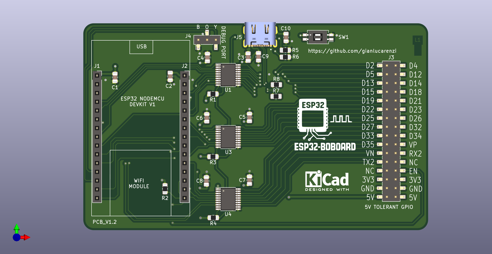

# ESP32-BOBOARD-5V

**ESP32 NodeMCU 5V Tolerant Breakout Board for 6502 Bus Monitoring**

## 🌐 Language / Lingua

[](README.md)
[](README_EN.md)

---


## 📋 Table of Contents

- [Project Overview](#project-overview)
- [Key Features](#key-features)
- [Technical Specifications](#technical-specifications)
- [3D Visualization](#3d-visualization)
- [Hardware Architecture](#hardware-architecture)
- [Firmware](#firmware)
- [Installation and Setup](#installation-and-setup)
- [Usage](#usage)
- [Flow Diagrams](#flow-diagrams)
- [Timing](#timing)
- [Project Files](#project-files)
- [Production](#production)
- [License](#license)
- [Contributing](#contributing)

## 🎯 Project Overview

ESP32-BOBOARD-5V is a specialized breakout board designed to interface an ESP32 NodeMCU module with 6502-based systems, such as the Atari 8-bit computers. The board provides:

- **5V tolerance** for all GPIO pins
- **Real-time 6502 bus monitoring**
- **PBI (Parallel Bus Interface) implementation** for Atari
- **Bidirectional level shifting** for 3.3V/5V compatibility
- **Standard connectors** for easy integration

### 🎮 Main Applications

- Monitoring and debugging 6502 systems
- PBI peripheral implementation for Atari
- Data/address bus traffic analysis
- External ROM and RAM emulation
- Smart cartridge development

## ✨ Key Features

### Hardware
- **ESP32 NodeMCU** compatible (240MHz dual-core)
- **3x TXS0108E** bidirectional level shifters
- **5V tolerance** on all GPIO pins
- **USB-C connector** for programming and power
- **Standard PBI connector** for Atari
- **Pin headers** for complete GPIO access
- **Status LEDs** and control buttons

### Firmware
- **High-speed 6502 bus monitoring**
- **Dual-core processing** (Core 0: Serial, Core 1: Monitor)
- **Complete PBI implementation** with device selection
- **Shadow RAM** for memory emulation
- **Colored debug output** via serial
- **Automatic GPIO testing** for hardware validation

## 🔧 Technical Specifications

| Parameter | Value |
|-----------|-------|
| **Microcontroller** | ESP32-WROOM-32 |
| **CPU Frequency** | 240 MHz (dual-core) |
| **Flash Memory** | 4MB |
| **RAM** | 520KB |
| **Available GPIO** | 30 pins |
| **Level Shifters** | 3x TXS0108E (8-bit bidirectional) |
| **Power Supply** | 5V via USB-C or pins |
| **I/O Logic** | 3.3V/5V tolerant |
| **PCB Dimensions** | 21.7mm x 21.7mm |
| **Layers** | 4 layer PCB |

### 6502 Bus Pinout

| Signal | ESP32 Pin | Description |
|---------|-----------|-------------|
| **A0-A1** | GPIO6, GPIO8 | Address Bus LSB (final rev. only) |
| **A2-A5** | GPIO21, GPIO27, GPIO33, GPIO32 | Address Bus |
| **A6-A7** | GPIO38, GPIO37 | Address Bus (final rev. only) |
| **A8-A15** | GPIO2, GPIO5, GPIO12, GPIO15, GPIO34, GPIO35, GPIO36, GPIO39 | Address Bus MSB |
| **D0-D7** | GPIO4, GPIO13, GPIO14, GPIO16, GPIO17, GPIO18, GPIO19, GPIO22 | Data Bus |
| **PHI2** | GPIO23 | Processor clock |
| **R/W** | GPIO25 | Read/Write signal |
| **CS** | GPIO26 | Chip Select for FPGA |

### Control Signals (Final Rev.)

| Signal | ESP32 Pin | Description |
|---------|-----------|-------------|
| **EXSEL** | GPIO11 | External memory select |
| **D1XX** | GPIO10 | PBI I/O space access |
| **CCTL** | GPIO20 | Cartridge control |
| **MPD** | GPIO7 | Math Pack ROM disable |

## 🎨 3D Visualization

### 📱 Interactive Online Viewers

View 3D models directly in your browser:

[](https://viewer.cadexchanger.com/)

[](https://3dviewer.net/?file=https://raw.githubusercontent.com/gianlucarenzi/esp32-boboard-5v/main/3D/ESP32-BOBOARD-5V.step)

[](https://viewer.autodesk.com/)


### 📥 Download 3D Files

| Format | Description | Download |
|---------|-------------|----------|
| **STEP** | Parametric CAD model | [](3D/ESP32-BOBOARD-5V.step) |
| **WRL** | VRML model for rendering | [](3D/ESP32-BOBOARD-5V.wrl) |

### 🖼️ 3D Image Gallery

<table>
  <tr>
    <td align="center">
      
      <br/><b>Isometric View</b>
    </td>
    <td align="center">
      
      <br/><b>Top View</b>
    </td>
  </tr>
  <tr>
    <td align="center">
      
      <br/><b>Bottom View</b>
    </td>
    <td align="center">
      
      <br/><b><a href="schematics/ESP32-BOBOARD-5V.pdf">📄 Electrical Schematic</a></b>
    </td>
  </tr>
</table>

### 🛠️ Recommended Software for Visualization

| Software | Format | Platform | Free |
|----------|---------|-------------|----------|
| **FreeCAD** | STEP, WRL | Windows, Linux, macOS | ✅ |
| **Fusion 360** | STEP | Windows, macOS | ✅ (Personal) |
| **Blender** | WRL | Windows, Linux, macOS | ✅ |
| **MeshLab** | WRL | Windows, Linux, macOS | ✅ |
| **CAD Exchanger Viewer** | STEP, WRL | Browser | ✅ |
| **3D Viewer Online** | STEP, WRL | Browser | ✅ |
| **Autodesk Viewer** | STEP | Browser | ✅ |

---

## 🏗️ Hardware Architecture

### Block Diagram


### Level Shifting

The board uses three TXS0108E to ensure compatibility between ESP32's 3.3V logic levels and the 6502 system's 5V:

- **TXS0108E #1**: Address Bus A8-A15 + controls
- **TXS0108E #2**: Data Bus D0-D7 (bidirectional)
- **TXS0108E #3**: Address Bus A0-A7 + additional signals

## 💻 Firmware

### Software Architecture

The firmware is based on FreeRTOS and uses both ESP32 cores:

- **Core 0**: Serial communication and debug management
- **Core 1**: High-speed 6502 bus monitoring

### Main Features

#### 1. 6502 Bus Monitoring
```cpp
// Optimized address bus reading
static inline uint16_t read_address_bus(void) {
    uint32_t gpio_low = read_gpio_low();
    uint32_t gpio_high = read_gpio_high();
    // Bit combination to reconstruct 16-bit address
    return address_reconstruction;
}
```

#### 2. PBI Implementation
- **Device Selection**: $D1FF register for device selection
- **I/O Registers**: $D100-$D1F0 for communication
- **Shadow RAM**: $D600-$D7FF for shared memory
- **ROM Driver**: $D800-$DFFF for PBI code

#### 3. Memory Management

| Address Range | Function | Access |
|----------------|----------|---------|
| **$D100-$D1F0** | PBI I/O Registers | R/W |
| **$D1FF** | Device Selection | R/W |
| **$D500-$D5FF** | Cartridge Control | R/W |
| **$D600-$D7FF** | Shadow RAM | R/W |
| **$D800-$DFFF** | PBI ROM Driver | R |

### Operating Modes

#### Test Mode
```cpp
#define TEST  // Enable GPIO test mode
```
- Automatic testing of all GPIO pins
- Hardware connection verification
- Colored diagnostic output

#### Monitor Mode
```cpp
#undef TEST  // Normal mode
```
- Continuous 6502 bus monitoring
- PBI protocol implementation
- Shadow memory management

## 🚀 Installation and Setup

### Hardware Requirements
- ESP32 NodeMCU (38 pin)
- USB-C cable for programming
- Target 6502 system (e.g. Atari 130XE)
- Bus connections according to pinout

### Software Requirements
- [PlatformIO](https://platformio.org/) or Arduino IDE
- ESP32 Arduino Core v2.0.14
- USB-C drivers for operating system

### Firmware Compilation

1. **Repository clone**:
```bash
git clone https://github.com/gianlucarenzi/esp32-boboard-5v.git
cd ESP32-BOBOARD-5V/firmware/6502_monitor
```

2. **PlatformIO configuration**:
```ini
[env:nodemcu-32s]
platform = espressif32
board = nodemcu-32s
framework = arduino
monitor_speed = 115200
board_build.f_cpu = 240000000
upload_speed = 921600
```

3. **Compilation and upload**:
```bash
pio run --target upload
pio device monitor
```

### Hardware Configuration

1. **ESP32 connection**: Insert NodeMCU module into sockets
2. **Power**: Connect USB-C or 5V power supply
3. **6502 Bus**: Connect according to specified pinout
4. **Test**: Run test mode to verify connections

## 📊 Usage

### System Startup

1. **Power-on**: Power up the board
2. **Serial monitor**: Open terminal at 115200 baud
3. **Initialization**: Wait for ready message
4. **6502 connection**: Connect to target system

### Serial Output

The firmware produces colored output to facilitate debugging:

```
🔵 6502 Bus Monitor Ready on Core 1
🟡 CCTL: Send $FF from $D500 to CPU
🟢 PBI I/O: Device $01 selected
🔴 PBI Read or Write @ $D150 address. Device must be selected first!
🟡 Shadow RAM: Received $42 to $D600 from CPU
```

### Debug Commands

The system supports different debug levels:
- `DBG_ERROR`: Critical errors only
- `DBG_INFO`: General information
- `DBG_VERBOSE`: Detailed debug
- `DBG_NOISY`: All messages

## 📈 Flow Diagrams

### Main Monitor Flow


### PBI Device Selection Protocol


### Shadow RAM Management


## ⏱️ Timing

### Critical Timings

| Operation | Time | Notes |
|------------|-------|------|
| **PHI2 Period** | 1.77 MHz (PAL) / 1.79 MHz (NTSC) | Atari 6502 clock |
| **Address Setup** | <100ns | Before PHI2 rising edge |
| **Data Setup** | <200ns | For write operations |
| **Data Hold** | <100ns | After PHI2 falling edge |
| **GPIO Read** | ~125ns | ESP32 register read |
| **Level Shift** | <10ns | TXS0108E propagation |

### 6502 Bus Timing Diagram


### Monitor Performance

- **Sampling frequency**: ~4 MHz (ESP32 limited)
- **Response latency**: <1μs for PBI operations
- **Serial throughput**: 115200 baud for debug
- **CPU usage**: ~80% Core 1, ~20% Core 0
- **Compatibility**: Atari PAL (1.77 MHz) and NTSC (1.79 MHz)

## 📁 Project Files

### Directory Structure

```
ESP32-BOBOARD-5V/
├── 📁 firmware/
│   └── 📁 6502_monitor/
│       ├── 📄 platformio.ini      # PlatformIO configuration
│       ├── 📁 src/
│       │   └── 📄 main.cpp        # Main firmware
│       └── 📁 include/
│           └── 📄 pbi-driver.h    # PBI ROM driver
├── 📁 schematics/
│   └── 📄 ESP32-BOBOARD-5V.pdf    # Electrical schematic
├── 📁 3D/
│   ├── 🖼️ ESP32-BOBOARD-5V.png    # 3D render
│   ├── 🖼️ ESP32-BOBOARD-5V_TOP.png
│   ├── 🖼️ ESP32-BOBOARD-5V_BOTTOM.png
│   └── 📄 ESP32-BOBOARD-5V.step   # 3D model
├── 📁 production/
│   ├── 📄 *.gbl, *.gtl           # Gerber files
│   ├── 📄 *.drl                  # Drill files
│   └── 📄 ESP32BOBOARD-5V-1.0.zip
├── 📁 ibom/
│   └── 📄 ibom.html              # Interactive BOM
├── 📄 ESP32-BOBOARD-5V.kicad_pcb  # KiCad PCB
├── 📄 ESP32-BOBOARD-5V.sch        # KiCad schematic
├── 📄 ESP32-BOBOARD-5V.csv        # Bill of Materials
└── 📄 README.md                   # This file
```

### Production Files

#### Bill of Materials (BOM)

| Component | Quantity | Package | LCSC Part |
|------------|----------|---------|-----------|
| **TXS0108EPW** | 3 | TSSOP-20 | C17206 |
| **100µF Capacitor** | 9 | 0805 | C141660 |
| **100nF Capacitor** | 1 | 0805 | C840116 |
| **10kΩ Resistor** | 4 | 0805 | C84376 |
| **5.1kΩ Resistor** | 2 | 0805 | C27834 |
| **1% Precision Resistor** | 2 | 0805 | C328378 |
| **Pin Socket 1x15** | 2 | THT | - |
| **Pin Header 2x16** | 1 | SMD | C6332241 |
| **USB-C Connector** | 1 | SMD | C3197885 |
| **SPST Switch** | 1 | SMD | C319052 |

#### Gerber Files
- **4-layer PCB** optimized for high-speed signals
- **Controlled impedance** for critical lines
- **Ground planes** for EMI reduction
- **Via stitching** for signal integrity

## 🏭 Production

### PCB Specifications

| Parameter | Value |
|-----------|--------|
| **Layers** | 4 |
| **Thickness** | 1.6mm |
| **Min Track** | 0.1mm |
| **Min Via** | 0.2mm |
| **Copper Weight** | 1oz (35μm) |
| **Surface Finish** | HASL Lead-Free |
| **Solder Mask** | Green |
| **Silkscreen** | White |

### Assembly

1. **SMD Components**: Automatic assembly recommended
2. **THT Components**: Manual soldering of pin headers
3. **Test**: Continuity check and functional test
4. **Programming**: Upload test firmware

### Versions

- **v1.1**: Prototype version (limited pins)
- **v1.2**: Final version (all pins available)

## 📜 License

This project is released under **GNU General Public License v3.0**.

```
ESP32-BOBOARD-5V - ESP32 NodeMCU 5V Tolerant Breakout Board
Copyright (C) 2024 RetroBitLab

This program is free software: you can redistribute it and/or modify
it under the terms of the GNU General Public License as published by
the Free Software Foundation, either version 3 of the License, or
(at your option) any later version.
```

See the [LICENSE](LICENSE) file for complete details.

## 🤝 Contributing

Contributions are welcome! To contribute:

1. **Fork** the repository
2. **Create** a feature branch (`git checkout -b feature/AmazingFeature`)
3. **Commit** your changes (`git commit -m 'Add some AmazingFeature'`)
4. **Push** to the branch (`git push origin feature/AmazingFeature`)
5. **Open** a Pull Request

### Contribution Areas

- 🐛 **Bug fixes** and firmware improvements
- 📚 **Documentation** and tutorials
- 🔧 **Hardware** optimizations and variants
- 🧪 **Testing** and validation
- 🎨 **Examples** and demo projects

### Reporting Issues

To report problems, use the [Issues](../../issues) system including:
- Detailed problem description
- Hardware and firmware version
- Serial logs if available
- Steps to reproduce the issue

---

## 📞 Contacts

- **Project**: ESP32-BOBOARD-5V
- **Author**: RetroBitLab
Repository: [GitHub](https://github.com/gianlucarenzi/esp32-boboard-5v)
- **Documentation**: [Wiki](../../wiki)

---

*Made with ❤️ for the retro-computing community*